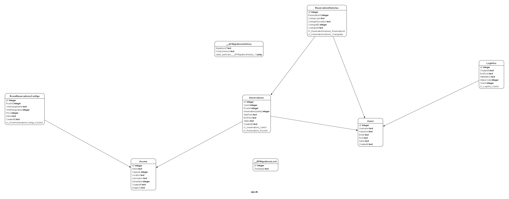

# CoWork API

Una API en .NET 9.0 para gestionar reservas de espacios de coworking. Este sistema permite a los usuarios registrarse, iniciar sesi贸n, gestionar salas y manejar reservas en un entorno de trabajo compartido.

## ���� Stack Tecnol贸gico

- **.NET 9.0**
- **Entity Framework Core** - ORM para operaciones con base de datos
- **MediatR** - Para implementar el patr贸n CQRS
- **JWT Authentication** - Para acceso seguro a la API
- **SQLite** - Base de datos
- **xUnit** - Framework de pruebas

## Resumen
El proyecto incluye:
- Pruebas unitarias
- Pruebas de integraci贸n
- Pruebas con base de datos en memoria

## ���� Registro de Actividad

El sistema incluye registro completo a trav茅s de ILogService:
- M茅todo HTTP
- Endpoint
- C贸digo de estado
- ID de usuario (cuando est谩 autenticado)

## ��?Consideraciones de Rendimiento

- Utiliza patrones async/await para operaciones no bloqueantes
- Implementa CQRS para mejor separaci贸n de operaciones de lectura/escritura
- Usa Entity Framework con indexaci贸n adecuada

## ���� Caracter铆sticas de Seguridad

- Encriptaci贸n de contrase帽as usando BCrypt
- Autenticaci贸n mediante tokens JWT
- Autorizaci贸n basada en roles
- Validaci贸n y sanitizaci贸n de entradas

## ���� Historial de Cambios
- Cada reserva mantiene un registro de modificaciones
- Se almacena fecha de creaci贸n, modificaci贸n y cancelaci贸n
- Sistema de auditor铆a para tracking de cambios

## ���� Optimizaci贸n y Cach茅
- Implementaci贸n de cach茅 en memoria para consultas frecuentes
- Cach茅 distribuido para listado de salas
- Invalidaci贸n autom谩tica de cach茅 en actualizaciones

## ���� Manejo de Errores

La API implementa un manejo consistente de errores con los siguientes c贸digos de estado:

- 200: Operaci贸n exitosa
- 201: Recurso creado exitosamente
- 400: Solicitud incorrecta
- 401: No autorizado
- 403: Prohibido
- 404: Recurso no encontrado
- 409: Conflicto (por ejemplo, en reservas superpuestas)

## ���� Comenzando

#### Prerequisitos

- SDK de .NET 9.0
- Un IDE (Visual Studio, VS Code o similar)

#### Instalaci贸n

1. Clonar el repositorio

```bash
git clone https://github.com/DenisDiaz/coworkingCS.git
```

#### 2. Navegar al directorio del proyecto
```bash
cd coworkingCS/CoWorkApi #for api implementation
cd coworkingCS/CoWorkApi.Tests #for api tests
```

#### 3. Instalar dependencias

```bash
dotnet restore
```

#### 4 Correr las migraciones

```bash
dotnet ef migrations add InitialCreate
dotnet ef database update
```
##### Note:
```bash
 #En Algunas configuraciones seg煤n la version de .NET instalada y las dependencias donet-ef puede no estar instalado para resolver el problema ejecutar:
 dotnet tool install --global dotnet-ef
```

#### 5. Correr el proyecto

```bash
dotnet run
```

La API estar谩 disponible en `http://localhost:5259`

## ���� Arquitectura

Este proyecto sigue los principios de Arquitectura Limpia con el patr贸n CQRS:

- **Controladores**: Manejan las peticiones y respuestas HTTP
- **Commands/Queries**: Implementan el patr贸n CQRS usando MediatR
- **Domain**: Contiene las entidades y l贸gica de negocio
- **Infrastructure**: Contexto de base de datos e implementaciones de servicios externos

## ���� Endpoints de la API

### Autenticaci贸n

#### Registrar Usuario

```bash
curl --request POST \
  --url http://127.0.0.1:5259/api/auth/register \
  --header 'Content-Type: application/json' \
  --data '{
  "username": "testuser2",
  "password": "password123",
  "email": "testuser2@example.com",
	"name" : "Usuairo de Prueba"
}
'
```
#### Iniciar Sesi贸n

```bash
curl --request POST \
  --url http://127.0.0.1:5259/api/auth/login \
  --header 'Content-Type: application/json' \
  --data '{
  "username": "testuser2",
  "password": "password123"
}
```

### Salas

#### Obtener Salas Disponibles

```bash
curl --request GET \
  --url 'http://localhost:5259/api/rooms/available?minimumCapacity=78&location=efgv&nameContains=w4dfsf'
```

#### Crear Sala (Solo Admin)

```bash
# POST /api/rooms
curl --request POST \
  --url http://localhost:5259/api/rooms \
  --header 'Authorization: Bearer {Token}' \
  --header 'Content-Type: multipart/form-data' \
  --header 'content-type: multipart/form-data; boundary=---011000010111000001101001' \
  --form 'Name=Sala con imagen' \
  --form Capacity=1000 \
  --form 'Description=Esto es una sala con imagen' \
  --form 'Location=Piso 1' \
  --form Image= \
  --form IsAvailable=true
```
### Reservas

#### Crear Reserva

```bash
curl --request POST \
  --url 'http:///127.0.0.1:5259/api/reservations?d='\''%3Cscript%3E'\''' \
  --header 'Authorization: Bearer {Token} \
  --header 'Content-Type: application/json' \
  --data '{
	"roomId":1,
	"Quantity":5,
	"startTime":"2024-01-19T11:00:00",
	"endTime":"2024-01-25T15:00:00"
}'
```


#### Obtener Reservas del Usuario

```bash
curl --request GET \
  --url http://localhost:5259/api/reservations \
  --header 'Authorization: Bearer {Token}' \
  --header 'Content-Type: application/x-www-form-urlencoded'
```

#### Actualizar Reserva
```bash
curl --request PUT \
  --url http:///127.0.0.1:5259/api/reservations/1 \
  --header 'Authorization: Bearer {Token}' \
  --header 'Content-Type: application/json' \
  --data '{
	"roomId":1,
	"Quantity":5,
	"startTime":"2024-01-10T11:00:00",
	"endTime":"2024-01-15T15:00:00"
}'
```

#### Eliminar Reserva
```bash
curl --request DELETE \
  --url http:///127.0.0.1:5259/api/reservations/1 \
  --header 'Authorization: Bearer {Token}'
```

#### Configurar las reservaciones de una sala

```bash
curl --request POST \
  --url http://localhost:5259/api/RoomReservationConfig \
  --header 'Authorization: Bearer {Token}' \
  --header 'Content-Type: application/json' \
  --data '{"roomId":1,
"TimeRangeName":"dia",
"timeRangeValue":1,
"name":"reserva por dia",
"price":500}'
```

## Swagger UI para entorno de desarrollo

```bash
http://localhost:5259/swagger/index.html
```


## ���� Autenticaci贸n

La API utiliza tokens JWT para la autenticaci贸n. Incluir el token en el encabezado Authorization:

```bash
Authorization: Bearer {Token}
```
## ���� Roles de Usuario

- **Usuario**: Puede realizar y gestionar sus propias reservas
- **Admin**: Puede gestionar salas, ver todas las reservas y modificar roles de usuario

## ��И Pruebas

Ejecutar las pruebas usando:

```bash
dotnet test
```

## Diagrama ER



Este README proporciona una visi贸n completa del sistema en espa帽ol, manteniendo un formato limpio y profesional. Puedes personalizar secciones espec铆ficas seg煤n caracter铆sticas o requisitos adicionales de tu implementaci贸n.